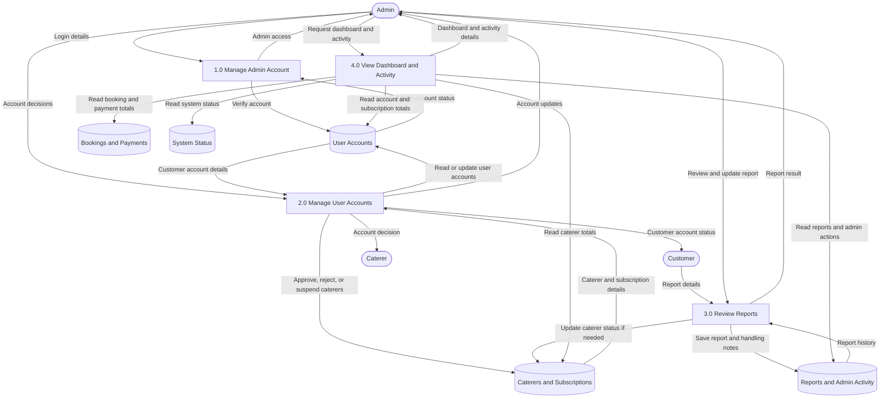

# Admin Data Flow Diagram

```mermaid
flowchart TD
    A([Admin])
    U([Customer])
    C([Caterer])

    P1[1.0 Manage Admin Account]
    P2[2.0 Manage User Accounts]
    P3[3.0 Review Reports]
    P4[4.0 View Dashboard and Activity]

    D1[(User Accounts)]
    D2[(Caterers and Subscriptions)]
    D3[(Bookings and Payments)]
    D4[(Reports and Admin Activity)]
    D5[(System Status)]

    A -->|Login details| P1
    P1 -->|Verify account| D1
    D1 -->|Admin account status| P1
    P1 -->|Admin access| A

    A -->|Account decisions| P2
    P2 -->|Read or update user accounts| D1
    D1 -->|Customer account details| P2
    P2 -->|Approve, reject, or suspend caterers| D2
    D2 -->|Caterer and subscription details| P2
    P2 -->|Account updates| A
    P2 -->|Account decision| C
    P2 -->|Customer account status| U

    U -->|Report details| P3
    A -->|Review and update report| P3
    P3 -->|Save report and handling notes| D4
    D4 -->|Report history| P3
    P3 -->|Update caterer status if needed| D2
    P3 -->|Report result| A

    A -->|Request dashboard and activity| P4
    P4 -->|Read account and subscription totals| D1
    P4 -->|Read caterer totals| D2
    P4 -->|Read booking and payment totals| D3
    P4 -->|Read reports and admin actions| D4
    P4 -->|Read system status| D5
    P4 -->|Dashboard and activity details| A
```

**Note:** Detailed technical services and database/API names are omitted to keep the diagram easy to read.
