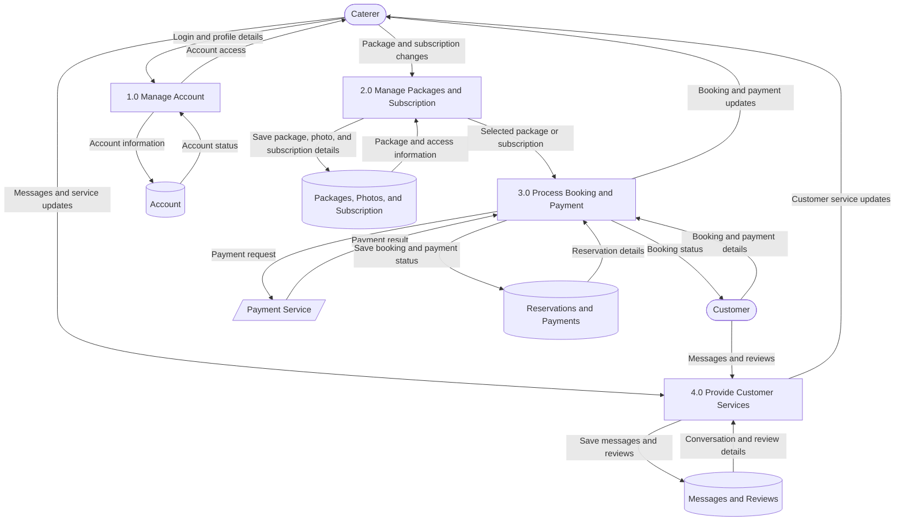

# Caterer Data Flow Diagram

```mermaid
flowchart TD
    C([Caterer])
    U([Customer])
    PAYMENT[/Payment Service/]

    P1[1.0 Manage Account]
    P2[2.0 Manage Packages and Subscription]
    P3[3.0 Process Booking and Payment]
    P4[4.0 Provide Customer Services]

    D1[(Account)]
    D2[(Packages, Photos, and Subscription)]
    D3[(Reservations and Payments)]
    D4[(Messages and Reviews)]

    C -->|Login and profile details| P1
    P1 -->|Account information| D1
    D1 -->|Account status| P1
    P1 -->|Account access| C

    C -->|Package and subscription changes| P2
    P2 -->|Save package, photo, and subscription details| D2
    D2 -->|Package and access information| P2

    P2 -->|Selected package or subscription| P3
    U -->|Booking and payment details| P3
    P3 -->|Payment request| PAYMENT
    PAYMENT -->|Payment result| P3
    P3 -->|Save booking and payment status| D3
    D3 -->|Reservation details| P3
    P3 -->|Booking and payment updates| C
    P3 -->|Booking status| U

    C -->|Messages and service updates| P4
    U -->|Messages and reviews| P4
    P4 -->|Save messages and reviews| D4
    D4 -->|Conversation and review details| P4
    P4 -->|Customer service updates| C
```

**Note:** Package photos, subscription access, cancellations, refunds, and AI-generated photos are grouped into the related processes to keep this diagram concise.
