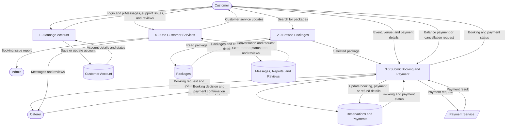

# Customer Data Flow Diagram

```mermaid
flowchart TD
    U([Customer])
    C([Caterer])
    A([Admin])
    PAYMENT[/Payment Service/]

    P1[1.0 Manage Account]
    P2[2.0 Browse Packages]
    P3[3.0 Submit Booking and Payment]
    P4[4.0 Use Customer Services]

    D1[(Customer Account)]
    D2[(Packages)]
    D3[(Reservations and Payments)]
    D4[(Messages, Reports, and Reviews)]

    U -->|Login and profile details| P1
    P1 -->|Save or update account| D1
    D1 -->|Account details and status| P1
    P1 -->|Account access| U

    U -->|Search for packages| P2
    P2 -->|Read package information| D2
    D2 -->|Packages and caterer details| P2
    P2 -->|Selected package| P3

    U -->|Event, venue, and payment details| P3
    P3 -->|Payment request| PAYMENT
    PAYMENT -->|Payment result| P3
    P3 -->|Save booking and payment| D3
    D3 -->|Booking and payment status| P3
    P3 -->|Booking request and updates| C
    C -->|Booking decision and payment confirmation| P3
    P3 -->|Booking and payment status| U
    U -->|Balance payment or cancellation request| P3
    P3 -->|Update booking, payment, or refund details| D3

    U -->|Messages, support issues, and reviews| P4
    P4 -->|Save messages, reports, and reviews| D4
    D4 -->|Conversation and request status| P4
    P4 -->|Messages and reviews| C
    P4 -->|Booking issue report| A
    P4 -->|Customer service updates| U
```

**Note:** GCash receipts, cancellations, refunds, and review photos are included in the booking and customer-service processes.
